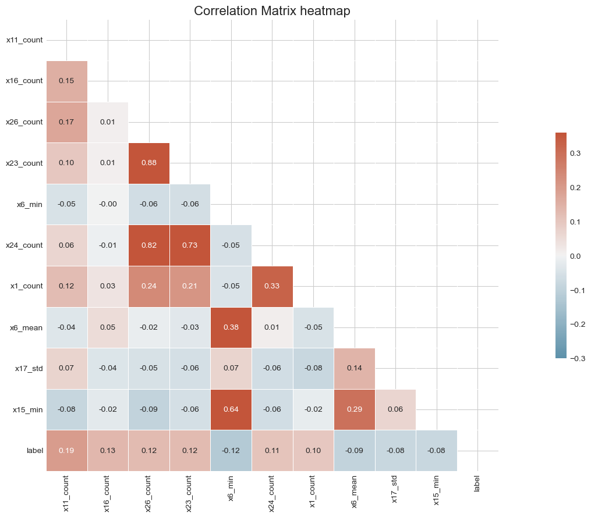
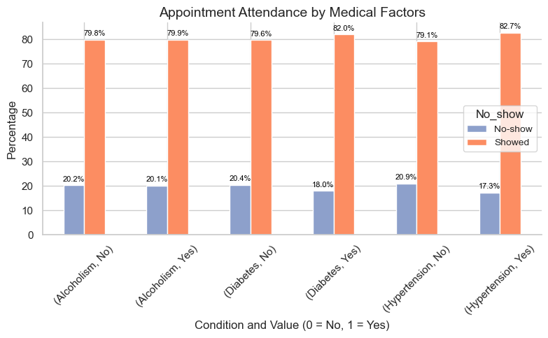
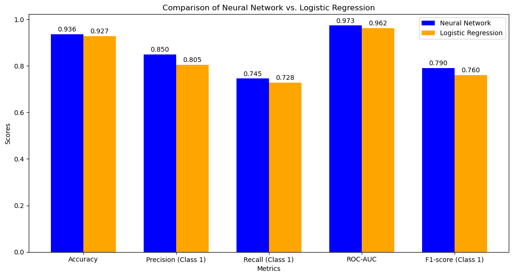

# Classification Projects Portfolio

> A collection of end-to-end classification and analytical projects across healthcare, finance, telecom, and clinical AI evaluation.

## Portfolio Overview

Many organizations collect large volumes of data but still struggle to turn it into reliable decisions. This portfolio applies classification, statistical analysis, and exploratory data analysis to four real-world problems in healthcare, finance, telecom, and clinical AI.

The projects are designed to answer practical questions such as:

- Can machine failures be anticipated from historical operating logs?
- Which patients are most likely to miss a medical appointment?
- Can financial ratios help identify companies at risk of failure?
- How do clinical AI tools differ in accuracy, evidence use, and practical usability?

Each project follows a structured workflow: define the problem, clean and explore the data, engineer useful features, evaluate appropriate methods, visualize the results, and translate the findings into actionable insights.

### Core toolkit

`Python` · `Pandas` · `NumPy` · `Scikit-learn` · `XGBoost` · `Seaborn` · `Matplotlib` · `Jupyter Notebook`

---

## Featured Projects

### 1. AI Clinical Evaluation Comparison

#### Problem

Healthcare professionals need to understand whether different AI assistants produce clinically useful answers—and where each tool is strongest or weakest.

#### Questions answered

- Which tool performs better across 50 clinical cases?
- Are the differences statistically significant or could they be due to chance?
- Which tool provides stronger supporting evidence and differential diagnoses?
- Which tool is more usable in day-to-day clinical practice?

#### Findings

OpenEvidence performed strongly in evidence use and differential diagnosis, while diagnostic accuracy and treatment-plan performance were broadly comparable. ChatGPT scored higher in practical usability.


[Explore the project](https://github.com/maha304/Classification-Projects/tree/main/ai-clinical-evaluation)

---

### 2. Telecom Machine Failure Analysis

#### Problem

Unexpected telecom machine failures can interrupt service and increase maintenance costs. Raw operational logs, however, are often inconsistent and difficult to use directly for prediction.

#### Questions answered

- What patterns distinguish failure days from normal operating days?
- Which measurements and engineered features are most associated with failure?
- Are some variables redundant or strongly correlated?
- Can historical logs be transformed into a reliable dataset for predictive maintenance?

#### Findings

More than 700 days of machine logs from 2015–2017 were cleaned and standardized. The workflow created 100+ time-based, statistical, and operational features, producing an analysis-ready foundation for future failure prediction.



[Explore the project](https://github.com/maha304/Classification-Projects/tree/main/telecom-machine-failure)

---

### 3. Medical Appointment No-show Prediction

#### Problem

Missed medical appointments waste clinical capacity, increase waiting times, and delay patient care. Identifying high-risk appointments can help providers target reminders and interventions more effectively.

#### Questions answered

- Which patients are most likely to miss an appointment?
- How do age, waiting time, SMS reminders, appointment day, and medical conditions relate to attendance?
- How can class imbalance between attended and missed appointments be handled?
- Which classification approach provides the best recall for no-show patients?

#### Findings

An XGBoost classification workflow was developed using 11 selected features and SMOTE class balancing. The model reached 80.1% recall for no-shows, making it useful for identifying a large share of at-risk appointments.

| Metric | Score |
|---|---:|
| Accuracy | 0.717 |
| Precision — No-show | 0.686 |
| Recall — No-show | 0.801 |
| ROC AUC | 0.788 |



[Explore the project](https://github.com/maha304/Classification-Projects/tree/main/medical-appointment-no-show)

---

### 4. Financial Failure Prediction

#### Problem

Investors, lenders, and business analysts need early warning signals that a company may be approaching financial failure. Financial ratios may reveal this risk before failure becomes obvious.

#### Questions answered

- Can a company's financial ratios predict whether it will fail?
- Which approach performs better: Neural Network or Logistic Regression?
- How well do the models identify failed companies rather than only the majority class?
- What trade-offs appear across accuracy, precision, recall, F1-score, and ROC-AUC?

#### Findings

A panel dataset containing 2,570 company records was analyzed. The Neural Network achieved 93.6% accuracy and 0.973 ROC-AUC, slightly outperforming Logistic Regression across the reported evaluation metrics.

| Model | Accuracy | ROC-AUC |
|---|---:|---:|
| Neural Network | 93.6% | 0.973 |
| Logistic Regression | 92.7% | 0.962 |



[Explore the project](https://github.com/maha304/Classification-Projects/tree/main/financial-failure-prediction)

---

## What This Portfolio Demonstrates

- Cleaning and validating real-world datasets
- Exploratory data analysis and clear visual storytelling
- Feature engineering for time-series, medical, and financial data
- Classification with XGBoost, Random Forest, Logistic Regression, and Neural Networks
- Model evaluation using recall, precision, F1-score, accuracy, and ROC-AUC
- Translating technical results into practical insights

## Repository Structure

```text
Classification-Projects/
├── ai-clinical-evaluation/
├── telecom-machine-failure/
├── medical-appointment-no-show/
└── financial-failure-prediction/
```

## Contact

Open to opportunities and collaboration in data analysis, business intelligence, and data science.

[GitHub Profile](https://github.com/maha304)

