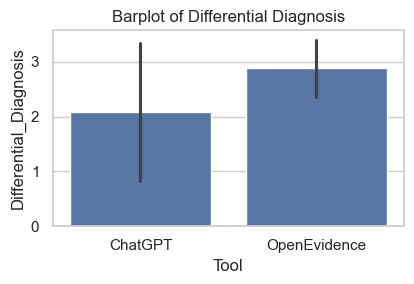

# AI Clinical Evaluation Comparison

## Problem

Healthcare professionals need to understand whether different AI assistants produce clinically useful answers—and where each tool is strongest or weakest. This project compares ChatGPT and OpenEvidence across 50 clinical cases using structured ordinal evaluation metrics.

## Questions Answered

- Which tool performs better across the clinical cases?
- Are the observed differences statistically significant?
- Which tool provides stronger evidence and differential diagnoses?
- Which tool is more usable in day-to-day clinical practice?

## Method

1. Clean and validate manually scored clinical-case data.
2. Compare the tools across diagnostic accuracy, evidence, differential diagnosis, treatment planning, requested tests, references, and usability.
3. Summarize score distributions with descriptive statistics and visualizations.
4. Apply statistical tests to assess whether differences are meaningful.

## Key Findings

- OpenEvidence performed substantially better in evidence use and differential diagnosis.
- Diagnostic accuracy and treatment-plan scores were broadly comparable.
- ChatGPT scored higher in practical usability.
- Findings are based on a 50-case evaluation and should not be interpreted as clinical validation.



## Repository Contents

- `Data/AI_research.csv` — evaluation dataset
- `Notebook/ai-clinical-evaluation.ipynb` — analysis and visualizations
- `Reports_results/` — statistical, descriptive, and visualization reports

## How to Run

```bash
pip install -r requirements.txt
jupyter notebook Notebook/ai-clinical-evaluation.ipynb
```

## Tools

Python, Pandas, NumPy, SciPy, Matplotlib, Seaborn, and Jupyter Notebook.

